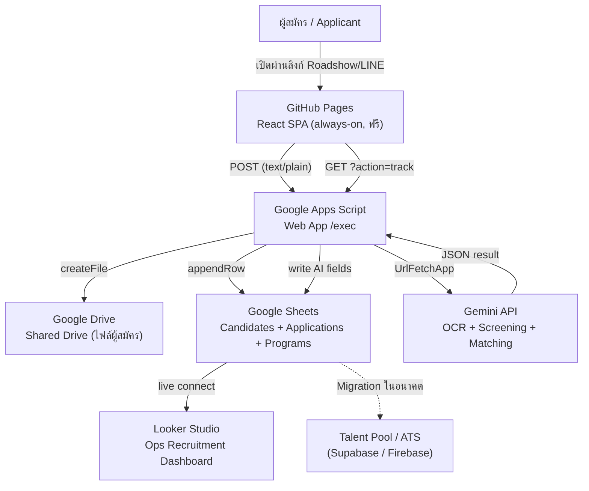
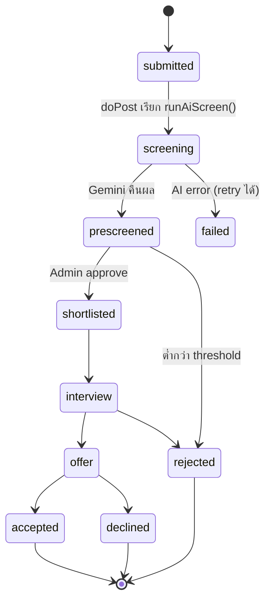

# Internship Recruitment Web Application — Build Specification
### CP AXTRA (Makro) | Talent Acquisition | สำหรับส่งต่อ Claude Code
**Architecture:** GitHub Pages (React) + Google Apps Script + Google Drive + Google Sheets + Looker Studio
**ต้นทุน:** $0 (ไม่ต้องผูกบัตร ไม่ต้อง procurement) | **Owner:** Bank — Recruitment Manager
**Version:** 2.0 (Zero-Cost Pilot Architecture)

---

## 0. สรุปการตัดสินใจเชิงสถาปัตยกรรม (Context สำหรับ Claude Code)

โปรเจกต์นี้เป็น **Internship Pilot** ที่ต้องเปิดตัวเร็ว ต้นทุนเป็นศูนย์ และไม่ต้องรออนุมัติงบ/ผูกบัตร จึงเลือก stack ที่อยู่บน Google Workspace + GitHub ทั้งหมด แทน Firebase/Supabase

> **หลักการสำคัญ:** ออกแบบ column ใน Google Sheet ให้ตรงกับ schema `candidates` / `applications` เป๊ะ ๆ เพื่อให้ pilot นี้ migrate เข้า **Talent Pool Module / ATS** (Supabase หรือ Firebase) ได้ในอนาคตโดยไม่ต้องรื้อ data model ใหม่ ดูข้อ 12 (Migration Path)

---

## 1. Objective & Scope

พัฒนา Web Application รับสมัครนักศึกษาฝึกงานครบวงจร:
1. **Application Form** — แนบ Resume / Transcript / Portfolio
2. **Program Info + Journey Visualization** — animation/video อธิบายเส้นทางโครงการ
3. **AI Pre-Screening อัตโนมัติ** — OCR + จับคู่ role/faculty + routing สาขา
4. **Dashboard + Candidate Profile + Application Tracking** — เห็นภาพรวม Ops Recruitment

---

## 2. System Architecture



**เหตุผลการเลือกแต่ละชิ้น:**

| Component | Tool | หน้าที่ |
|---|---|---|
| Frontend Hosting | **GitHub Pages** | โฮสต์ React static build — always-on, ไม่มี inactivity pause, ฟรี |
| Backend/API | **Google Apps Script Web App** | endpoint `doPost`/`doGet` รับฟอร์ม + logic ทั้งหมด |
| File Storage | **Google Drive (Shared Drive)** | เก็บ Resume/Transcript/Portfolio ผ่าน `DriveApp` |
| Database | **Google Sheets** | เก็บ metadata (ตรงกับ pattern DatabaseUpdater เดิม) |
| AI Engine | **Gemini API** (Google AI Studio key) | อ่าน PDF + screening ในครั้งเดียว, free tier ไม่ต้องบัตร |
| Dashboard | **Looker Studio** | Ops Recruitment Overview เชื่อม Sheet ตรง |
| CI/CD | **GitHub Actions** | auto-build + deploy ขึ้น Pages ทุก push |

---

## 3. Data Flow & Status Lifecycle



---

## 4. Google Sheets Schema (Database)

สร้าง Spreadsheet 1 ไฟล์ มี 3 แท็บ **column ต้องเรียงตามนี้เป๊ะ ๆ** (Apps Script อ้างอิงตำแหน่ง)

### Tab: `Candidates`
| # | Column | หมายเหตุ |
|---|---|---|
| A | candidateId | `C` + uuid 8 หลัก |
| B | source | `internship_portal` |
| C | firstName | |
| D | lastName | |
| E | email | |
| F | phone | |
| G | lineUserId | เผื่อเชื่อม Career Portal |
| H | university | |
| I | faculty | |
| J | major | |
| K | gpa | number |
| L | yearLevel | |
| M | expectedGradYear | |
| N | resumeUrl | Drive link |
| O | resumeFileId | Drive fileId |
| P | transcriptUrl | |
| Q | transcriptFileId | |
| R | portfolioJson | JSON array [{name,url,id}] |
| S | aiStatus | pending/processing/done/failed |
| T | aiMatchScore | 0-100 |
| U | aiMatchedRolesJson | JSON [{role,score}] |
| V | aiRecommendedBranch | routing result |
| W | aiSummary | สรุปโปรไฟล์ |
| X | aiFlagsJson | JSON array |
| Y | screenedAt | |
| Z | consentAccepted | PDPA |
| AA | consentVersion | เช่น `2026-v1` |
| AB | consentAt | |
| AC | createdAt | |
| AD | updatedAt | |

### Tab: `Applications`
| # | Column | หมายเหตุ |
|---|---|---|
| A | applicationId | `A` + uuid 8 หลัก |
| B | candidateId | FK -> Candidates |
| C | programId | FK -> Programs |
| D | trackingCode | `MKR-INT-2026-0001` |
| E | positionApplied | |
| F | assignedBranch | |
| G | status | ดู lifecycle ข้อ 3 |
| H | statusHistoryJson | JSON [{status,at,by,note}] |
| I | reviewerNotes | |
| J | createdAt | |
| K | updatedAt | |

### Tab: `Programs`
| # | Column | หมายเหตุ |
|---|---|---|
| A | programId | |
| B | name | |
| C | description | |
| D | journeyStepsJson | JSON [{order,title,description,icon,durationWeeks}] |
| E | eligibleFacultiesJson | JSON array |
| F | quota | |
| G | openDate | |
| H | closeDate | |
| I | isActive | TRUE/FALSE |
| J | journeyVideoUrl | (ตัดจาก CapCut → YouTube unlisted) |
| K | lottieJsonUrl | (export จาก Canva) |

---

## 5. Google Drive Structure (Shared Drive)

**ต้องใช้ Shared Drive ขององค์กร ไม่ใช่ My Drive ส่วนตัว** (data governance + PDPA + ไม่ผูกกับบัญชีบุคคล)

```
[Shared Drive] Internship-Recruitment-2026/
├── applicants/
│   ├── C1a2b3c4/            (โฟลเดอร์ต่อผู้สมัคร = candidateId)
│   │   ├── resume_xxx.pdf
│   │   ├── transcript_xxx.pdf
│   │   └── portfolio_0_xxx.pdf
│   └── ...
└── _archive/                (ย้ายไฟล์ผู้สมัครที่หมดอายุ retention)
```

---

## 6. Google Apps Script Backend (starter code — ให้ Claude Code refine)

> ตั้งค่าใน **Project Settings → Script Properties**: `SHEET_ID`, `DRIVE_FOLDER_ID`, `SUBMIT_TOKEN`, `ADMIN_TOKEN`, `GEMINI_API_KEY` (ห้าม hardcode secret ในโค้ด)

### `Code.gs` — Router
```javascript
const PROPS = PropertiesService.getScriptProperties();
const SHEET_ID = PROPS.getProperty('SHEET_ID');
const DRIVE_FOLDER_ID = PROPS.getProperty('DRIVE_FOLDER_ID'); // โฟลเดอร์ applicants/ ใน Shared Drive
const SUBMIT_TOKEN = PROPS.getProperty('SUBMIT_TOKEN');
const ADMIN_TOKEN = PROPS.getProperty('ADMIN_TOKEN');
const GEMINI_API_KEY = PROPS.getProperty('GEMINI_API_KEY');

function doPost(e) {
  try {
    const body = JSON.parse(e.postData.contents);
    if (body.token !== SUBMIT_TOKEN) return json({ ok: false, error: 'unauthorized' });
    switch (body.action) {
      case 'apply': return json(handleApply(body.payload));
      default:      return json({ ok: false, error: 'unknown_action' });
    }
  } catch (err) {
    return json({ ok: false, error: String(err) });
  }
}

function doGet(e) {
  const p = e.parameter;
  if (p.action === 'programs') return json({ ok: true, programs: listPrograms() });
  if (p.action === 'track')    return json(handleTrack(p.trackingCode, p.email));
  if (p.action === 'candidate' && p.adminToken === ADMIN_TOKEN) return json(getCandidate(p.candidateId));
  if (p.action === 'list' && p.adminToken === ADMIN_TOKEN)      return json(listCandidates());
  return json({ ok: false, error: 'unknown_action' });
}

function json(obj) {
  return ContentService.createTextOutput(JSON.stringify(obj))
    .setMimeType(ContentService.MimeType.JSON);
}
```

### `Apply.gs` — สร้าง Candidate + Application + เซฟไฟล์
```javascript
function handleApply(payload) {
  const lock = LockService.getScriptLock();
  lock.waitLock(30000); // กัน race condition ตอนหลายคนสมัครพร้อมกัน
  try {
    const ss = SpreadsheetApp.openById(SHEET_ID);
    const candSheet = ss.getSheetByName('Candidates');
    const appSheet  = ss.getSheetByName('Applications');
    const now = new Date();
    const candidateId = 'C' + Utilities.getUuid().replace(/-/g, '').slice(0, 8);
    const applicationId = 'A' + Utilities.getUuid().replace(/-/g, '').slice(0, 8);

    // 1) เซฟไฟล์ลง Drive (โฟลเดอร์ต่อผู้สมัคร)
    const folder = DriveApp.getFolderById(DRIVE_FOLDER_ID).createFolder(candidateId);
    const resume     = payload.files.resume     ? saveFile(folder, payload.files.resume, 'resume') : {};
    const transcript = payload.files.transcript ? saveFile(folder, payload.files.transcript, 'transcript') : {};
    const portfolio  = (payload.files.portfolio || []).map((f, i) => saveFile(folder, f, 'portfolio_' + i));

    // 2) Tracking code
    const seq = appSheet.getLastRow(); // pilot-simple; ถ้า concurrency สูงใช้ counter ใน Script Properties
    const trackingCode = 'MKR-INT-2026-' + String(seq).padStart(4, '0');

    // 3) เขียน Candidate row (เรียงตาม schema ข้อ 4)
    candSheet.appendRow([
      candidateId, 'internship_portal',
      payload.personal.firstName, payload.personal.lastName, payload.personal.email,
      payload.personal.phone, payload.personal.lineUserId || '',
      payload.education.university, payload.education.faculty, payload.education.major,
      payload.education.gpa, payload.education.yearLevel, payload.education.expectedGradYear,
      resume.url || '', resume.id || '', transcript.url || '', transcript.id || '',
      JSON.stringify(portfolio),
      'pending', '', '', '', '', '', '',           // AI fields (เติมทีหลัง)
      payload.consent.accepted, payload.consent.version, now,
      now, now
    ]);

    // 4) เขียน Application row
    appSheet.appendRow([
      applicationId, candidateId, payload.programId, trackingCode, payload.positionApplied, '',
      'submitted', JSON.stringify([{ status: 'submitted', at: now, by: 'system' }]), '',
      now, now
    ]);

    lock.releaseLock();

    // 5) เรียก AI screening (ยังอยู่ใน execution เดียว — ถ้าช้าให้ย้ายไป time-driven trigger)
    try { runAiScreen(candidateId, resume, payload); } catch (aiErr) { /* ไม่ให้ล้มการสมัคร */ }

    return { ok: true, trackingCode: trackingCode, candidateId: candidateId };
  } catch (err) {
    if (lock.hasLock()) lock.releaseLock();
    return { ok: false, error: String(err) };
  }
}

function saveFile(folder, fileObj, prefix) {
  // fileObj = { name, mimeType, dataBase64 }  (frontend เข้ารหัสมาแล้ว)
  const bytes = Utilities.base64Decode(fileObj.dataBase64);
  const blob = Utilities.newBlob(bytes, fileObj.mimeType, prefix + '_' + fileObj.name);
  const file = folder.createFile(blob);
  return { id: file.getId(), url: file.getUrl(), name: fileObj.name };
}
```

### `AiScreen.gs` — Gemini อ่าน PDF + screening ในครั้งเดียว
```javascript
function runAiScreen(candidateId, resume, payload) {
  if (!resume || !resume.id) return;

  const blob = DriveApp.getFileById(resume.id).getBlob();
  const b64 = Utilities.base64Encode(blob.getBytes());

  const prompt =
    'คุณคือผู้ช่วย HR pre-screening ของ CP AXTRA (Makro). อ่าน Resume ที่แนบ (OCR) ' +
    'แล้วประเมินความเหมาะสมกับตำแหน่งฝึกงาน Operations. ' +
    'ข้อมูลผู้สมัคร: คณะ=' + payload.education.faculty + ', สาขา=' + payload.education.major +
    ', GPA=' + payload.education.gpa + '. ' +
    'ตอบกลับเป็น JSON เท่านั้น: {"matchScore": number(0-100), ' +
    '"matchedRoles":[{"role":string,"score":number}], "recommendedBranch": string, ' +
    '"summary": string(<=3 บรรทัด), "flags":[string]}';

  const req = {
    contents: [{ parts: [
      { text: prompt },
      { inline_data: { mime_type: 'application/pdf', data: b64 } }
    ]}],
    generationConfig: { responseMimeType: 'application/json' }
  };

  // NOTE: ตรวจชื่อ model ล่าสุดก่อน deploy (เช่น gemini-2.5-flash) — ค่านี้เปลี่ยนได้
  const url = 'https://generativelanguage.googleapis.com/v1beta/models/gemini-2.5-flash:generateContent?key=' + GEMINI_API_KEY;
  const res = UrlFetchApp.fetch(url, {
    method: 'post', contentType: 'application/json',
    payload: JSON.stringify(req), muteHttpExceptions: true
  });

  const data = JSON.parse(res.getContentText());
  const text = data.candidates[0].content.parts[0].text;
  const ai = JSON.parse(text);

  updateCandidateAi(candidateId, ai);
  setApplicationStatusByCandidate(candidateId, 'prescreened', 'ai');
}

function updateCandidateAi(candidateId, ai) {
  const sh = SpreadsheetApp.openById(SHEET_ID).getSheetByName('Candidates');
  const ids = sh.getRange('A2:A').getValues().flat();
  const row = ids.indexOf(candidateId) + 2;
  if (row < 2) return;
  // S=aiStatus(19) ... Y=screenedAt(25)
  sh.getRange(row, 19, 1, 7).setValues([[
    'done', ai.matchScore, JSON.stringify(ai.matchedRoles || []),
    ai.recommendedBranch || '', ai.summary || '', JSON.stringify(ai.flags || []), new Date()
  ]]);
}
```

### `Track.gs` / `Admin.gs` — helper
```javascript
function handleTrack(trackingCode, email) {
  const ss = SpreadsheetApp.openById(SHEET_ID);
  const app = findRow(ss.getSheetByName('Applications'), 4, trackingCode); // col D
  if (!app) return { ok: false, error: 'not_found' };
  const cand = findRow(ss.getSheetByName('Candidates'), 1, app[1]);        // col A
  if (!cand || String(cand[4]).toLowerCase() !== String(email).toLowerCase())
    return { ok: false, error: 'email_mismatch' }; // กันคนอื่นดูสถานะ
  return { ok: true, status: app[6], statusHistory: JSON.parse(app[7] || '[]'), trackingCode: trackingCode };
}

function getCandidate(candidateId) {
  const sh = SpreadsheetApp.openById(SHEET_ID).getSheetByName('Candidates');
  const row = findRow(sh, 1, candidateId);
  if (!row) return { ok: false, error: 'not_found' };
  return { ok: true, candidate: rowToCandidate(row) }; // map เป็น object ตาม schema
}

function listPrograms() {
  const sh = SpreadsheetApp.openById(SHEET_ID).getSheetByName('Programs');
  return sh.getDataRange().getValues().slice(1)
    .filter(r => r[8] === true || String(r[8]).toUpperCase() === 'TRUE')
    .map(r => ({ programId: r[0], name: r[1], description: r[2],
      journeySteps: JSON.parse(r[3] || '[]'), eligibleFaculties: JSON.parse(r[4] || '[]'),
      quota: r[5], openDate: r[6], closeDate: r[7],
      journeyVideoUrl: r[9], lottieJsonUrl: r[10] }));
}

function findRow(sheet, col, value) {
  const data = sheet.getDataRange().getValues();
  for (let i = 1; i < data.length; i++) if (String(data[i][col - 1]) === String(value)) return data[i];
  return null;
}
```

---

## 7. Frontend (React + Vite → GitHub Pages)

### โครงสร้างโปรเจกต์
```
/src
  /pages
    Landing.tsx          (ข้อมูลโครงการ + ปุ่มสมัคร)
    ProgramJourney.tsx   (Journey visualization — Framer Motion)
    Apply.tsx            (ฟอร์ม + upload)
    TrackStatus.tsx      (ติดตามใบสมัคร)
  /admin
    Dashboard.tsx        (embed Looker Studio + สรุป)
    CandidateProfile.tsx (เปิดดูโปรไฟล์ + AI result — token-protected)
  /components
    FileUpload.tsx  JourneyTimeline.tsx  StatusStepper.tsx
  /lib
    api.ts               (เรียก Apps Script)
    fileToBase64.ts
  config.ts              (APPS_SCRIPT_URL, SUBMIT_TOKEN)
.github/workflows/deploy.yml
vite.config.ts
```

### `lib/api.ts` — เรียก Apps Script (CORS-safe pattern สำคัญมาก)
```typescript
import { APPS_SCRIPT_URL, SUBMIT_TOKEN } from '../config';

// ใช้ Content-Type: text/plain เพื่อเลี่ยง CORS preflight ของ Apps Script (gotcha สำคัญ)
export async function submitApplication(payload: any) {
  const res = await fetch(APPS_SCRIPT_URL, {
    method: 'POST',
    headers: { 'Content-Type': 'text/plain;charset=utf-8' },
    body: JSON.stringify({ token: SUBMIT_TOKEN, action: 'apply', payload }),
  });
  return res.json();
}

export async function fetchPrograms() {
  const res = await fetch(APPS_SCRIPT_URL + '?action=programs');
  return res.json();
}

export async function trackStatus(trackingCode: string, email: string) {
  const url = APPS_SCRIPT_URL + '?action=track&trackingCode=' +
    encodeURIComponent(trackingCode) + '&email=' + encodeURIComponent(email);
  const res = await fetch(url);
  return res.json();
}
```

### `lib/fileToBase64.ts`
```typescript
export function fileToBase64(file: File): Promise<{name:string; mimeType:string; dataBase64:string}> {
  return new Promise((resolve, reject) => {
    const reader = new FileReader();
    reader.onload = () => {
      const result = reader.result as string;
      resolve({ name: file.name, mimeType: file.type, dataBase64: result.split(',')[1] });
    };
    reader.onerror = reject;
    reader.readAsDataURL(file);
  });
}
```

### `vite.config.ts` (base path สำหรับ GitHub Pages)
```typescript
import { defineConfig } from 'vite';
import react from '@vitejs/plugin-react';
export default defineConfig({
  plugins: [react()],
  base: '/internship-portal/', // = ชื่อ repo; ถ้าใช้ custom domain ให้เป็น '/'
});
```

### `.github/workflows/deploy.yml`
```yaml
name: Deploy to GitHub Pages
on:
  push: { branches: [main] }
permissions: { contents: read, pages: write, id-token: write }
jobs:
  build:
    runs-on: ubuntu-latest
    steps:
      - uses: actions/checkout@v4
      - uses: actions/setup-node@v4
        with: { node-version: 20 }
      - run: npm ci
      - run: npm run build
      - uses: actions/upload-pages-artifact@v3
        with: { path: dist }
  deploy:
    needs: build
    runs-on: ubuntu-latest
    environment: { name: github-pages }
    steps:
      - uses: actions/deploy-pages@v4
```

### Journey Visualization
- เริ่มด้วย **Framer Motion** timeline (สมัคร → คัดกรอง AI → สัมภาษณ์ → ฝึกงาน → จบโครงการ) render จาก `journeyStepsJson`
- Slot สำหรับ **วิดีโอ (ตัด CapCut → YouTube unlisted, embed)** และ **Lottie (export Canva)** ผ่าน `journeyVideoUrl` / `lottieJsonUrl`

---

## 8. Dashboard (Looker Studio — Ops Recruitment Overview)

- เชื่อม Looker Studio → Google Sheet (`Candidates` + `Applications`) แบบ live
- Metric ให้สะท้อน **ภาพรวมทั้ง Operations ไม่จำกัดกลุ่มย่อย**: ยอดสมัครรวม, แยกตาม Program/มหาวิทยาลัย/คณะ/สาขา, funnel ตามสถานะ, จำนวนผ่าน AI pre-screen, การกระจายตามสาขา (routing), เวลาเฉลี่ยแต่ละสถานะ
- เตรียม export/link เข้า **Master Data Dashboard** รวมกับ HRIS/ATS ในอนาคต
- **Candidate Profile:** หน้า `CandidateProfile.tsx` เรียก `?action=candidate&adminToken=...` แสดงข้อมูลครบ + preview ไฟล์ Drive + ผล AI (score, summary, matched roles, recommended branch, flags) + ปุ่มเปลี่ยนสถานะ

---

## 9. Security & PDPA

- **PDPA Consent:** บังคับติ๊กก่อน submit + เก็บ version/timestamp (คอลัมน์ Z/AA/AB)
- **Shared Drive เท่านั้น** — ไฟล์ไม่ผูกบัญชีบุคคล องค์กรควบคุมสิทธิ์ได้
- **Token 2 ชุด:** `SUBMIT_TOKEN` (ฟอร์มสาธารณะ — กัน spam ระดับพื้นฐาน แนะนำเสริม reCAPTCHA) และ `ADMIN_TOKEN` (แยกต่างหาก เฉพาะ endpoint ดูโปรไฟล์/รายการ)
- **Track ต้องยืนยัน email** ให้ตรงกับ candidate กันคนอื่นเปิดดูสถานะ
- **Data Retention:** time-driven trigger ลบ/ย้ายไฟล์ผู้สมัครที่ไม่ผ่านเข้า `_archive/` หลัง X เดือน
- ไม่ hardcode secret — ใช้ **Script Properties** ทั้งหมด

---

## 10. ข้อจำกัด/โควตาที่ต้องรู้ (Gotchas สำหรับ Claude Code)

1. **Apps Script quota** — UrlFetchApp ~20,000 ครั้ง/วัน (Workspace สูงกว่า), execution time 6 นาที (consumer) / 30 นาที (Workspace) → ถ้า AI screening ช้า ให้ย้ายไป **time-driven trigger** สแกน row ที่ `aiStatus=pending` เป็น batch แทนการรันใน doPost
2. **File size** — POST ผ่าน base64 ทำให้ payload ใหญ่ขึ้น ~33% บังคับ **จำกัดขนาดไฟล์ที่ frontend** (แนะนำ Resume/Transcript ≤ 5MB, portfolio ≤ 10MB)
3. **CORS** — ต้อง POST ด้วย `Content-Type: text/plain` เท่านั้น (ห้าม application/json ไม่งั้นเจอ preflight ที่ Apps Script จัดการไม่ได้)
4. **Google Sheets ไม่ใช่ DB จริง** — เหมาะหลักร้อย–พันแถว ใช้ `LockService` เสมอ, batch read/write, เลี่ยง query ซับซ้อน พอเกินหลักหมื่นให้ migrate (ดูข้อ 12)
5. **Deploy Web App** — ตั้ง "Execute as: Me", "Who has access: Anyone" และทุกครั้งที่แก้โค้ดต้อง **New deployment / Manage deployments → เวอร์ชันใหม่** ถึงจะมีผล
6. **Gemini model name** — ตรวจชื่อ model ล่าสุดก่อน deploy

---

## 11. Development Phases

| Phase | Deliverable |
|---|---|
| **P1 — Setup** | สร้าง Google Sheet (3 แท็บตาม schema), Shared Drive, Apps Script project + Script Properties, deploy Web App รับ URL |
| **P2 — Backend** | `Code.gs` + `Apply.gs` + `Track.gs` + `Admin.gs` — ทดสอบ POST/GET |
| **P3 — Frontend** | React + Vite: Landing, ProgramJourney (Framer Motion), Apply + FileUpload, TrackStatus |
| **P4 — AI Screen** | `AiScreen.gs` (Gemini) + ตัดสินใจ inline vs trigger |
| **P5 — Dashboard** | Looker Studio + CandidateProfile page |
| **P6 — Deploy** | GitHub Actions → Pages, ตั้ง custom domain (ถ้ามี), ทดสอบ end-to-end |

---

## 12. Migration Path (สำคัญเชิงกลยุทธ์)

pilot นี้คือ **backend ชั่วคราวเพื่อพิสูจน์ระบบ** ไม่ใช่ปลายทาง เมื่อได้งบ/scale จริง:
- `Candidates` / `Applications` sheet → **Postgres tables (Supabase)** หรือ **Firestore collections** — เพราะ column map 1:1 กับ schema เดิมอยู่แล้ว export CSV → import ได้ตรง
- Drive files → Supabase Storage / Cloud Storage
- Apps Script logic → Edge Functions / Cloud Functions
- ปลายทางเชื่อมเข้า **Talent Pool Module → ATS → Master Data Dashboard** ตามแผนปี 2026

---

## 13. Hand-off Prompt สำหรับ Claude Code

> คัดลอกส่วนนี้เป็น context เริ่มต้น

**ตัวอย่าง prompt (สั่งทีละ Phase):**
> "อ่าน spec `internship-webapp-spec.md` แล้วเริ่ม Phase 2 (Backend): สร้างไฟล์ Apps Script ทั้งหมด (`Code.gs`, `Apply.gs`, `AiScreen.gs`, `Track.gs`, `Admin.gs`) ตามโค้ดในข้อ 6 ให้อ่านค่าจาก Script Properties ทั้งหมด และเขียน `rowToCandidate`, `updateCandidateAi`, `setApplicationStatusByCandidate`, `listCandidates` ให้ครบ พร้อมคอมเมนต์ภาษาไทย จากนั้นบอกวิธี deploy Web App และทดสอบด้วย curl"

**ลำดับที่แนะนำ:** P1 (ตั้งค่า Google เอง) → สั่ง Claude Code ทำ P2 → P3 → P4 → P5 → P6

**หมายเหตุการ Deploy:** Claude Code รันบนเครื่อง Bank (มี credential + network) จึง `clasp push`/`clasp deploy` สำหรับ Apps Script และ push GitHub เพื่อ trigger Actions ได้โดยตรง ส่วนการสร้าง Google Sheet/Drive/Script Properties + วาง Gemini API key ต้องทำในบัญชี Google Workspace ขององค์กรเอง (P1)

---

*Schema และ data flow ออกแบบให้ migrate เข้า Talent Pool / ATS ได้โดยไม่ต้อง re-architect — สอดคล้องกับ digital recruitment ecosystem ปี 2026*
